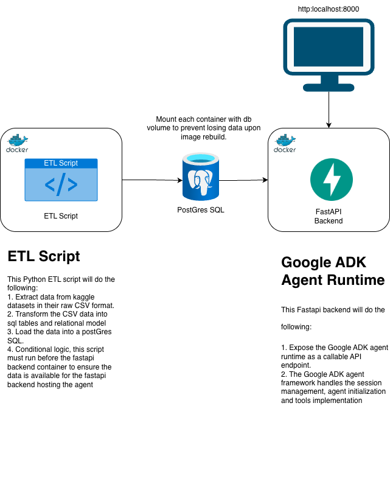

# Anthelion Agent Platform

A production-grade AI agent platform that runs end-to-end with a single command. The agent has access to NYSE market data and news headlines, exposes a FastAPI HTTP interface, and uses Google ADK for session management and tool orchestration.

> For architecture decisions, tradeoffs, and the production evolution path see [DECISIONS.md](./DECISIONS.md).

---

## Architecture



**ETL Script → PostgreSQL → FastAPI + Google ADK Agent**

| Container | Role |
|---|---|
| `db_init` | Loads all CSV datasets into PostgreSQL once at startup |
| `postgres` | Stores market data, news headlines, and ADK session state |
| `agent` | FastAPI server hosting the Google ADK agent at `localhost:8000` |

---

## Project Structure

```
anthelion-project/
├── docker-compose.yml          # Orchestrates all three services
├── Dockerfile                  # Shared image for db_init and agent
├── requirements.txt            # Python dependencies
│
├── agent.py                    # Google ADK agent definition and runner
├── api.py                      # FastAPI wrapper — exposes agent as HTTP endpoint
├── tools.py                    # SQL-backed agent tools (price, news, fundamentals)
├── db_init.py                  # One-shot ETL: loads CSVs into PostgreSQL
│
├── data/
│   ├── abcnews-date-text.csv   # 1.2M news headlines (2003–2021)
│   └── nyse_data/
│       ├── prices.csv              # Raw NYSE daily prices (2016)
│       ├── prices-split-adjusted.csv  # Split-adjusted prices (2016)
│       ├── fundamentals.csv        # Annual financials for ~448 S&P 500 companies
│       └── securities.csv          # S&P 500 company metadata (505 companies)
│
├── DECISIONS.md                # Architecture decisions and production evolution path
└── Anthelion-Project.drawio.pdf  # Architecture diagram
```

---

## Quick Start

Requires Docker Desktop to be running.

```bash
docker compose up --build
```

On first run this will:
1. Build the Python image
2. Start PostgreSQL
3. Run `db_init` — loads ~2.95M rows from CSV into PostgreSQL (~1–2 min)
4. Start the FastAPI server at `http://localhost:8000`

Subsequent runs skip the image build and data load and start in seconds.

---

## API

### `POST /analyze`

Sends a task to the agent. The agent calls its data tools, makes an LLM call, and returns a structured analysis.

```bash
# Default demo task (AAPL analysis)
curl -X POST http://localhost:8000/analyze \
  -H "Content-Type: application/json" \
  -d '{}'

# Custom task
curl -X POST http://localhost:8000/analyze \
  -H "Content-Type: application/json" \
  -d '{"task": "Compare MSFT and GOOGL performance in Q3 2016"}'
```

**Response:**
```json
{
  "task": "...",
  "response": "## Company Overview\n...",
  "elapsed_seconds": 14.2
}
```

### `GET /health`

```bash
curl http://localhost:8000/health
# {"status": "ok"}
```

### Interactive Docs

FastAPI auto-generates a UI at **http://localhost:8000/docs**.

---

## Agent Tools

The agent has four SQL-backed tools it calls autonomously:

| Tool | Data Source | Description |
|---|---|---|
| `get_company_info` | `securities` | Company name, sector, HQ |
| `get_price_history` | `prices_adjusted` | Daily OHLCV + summary stats (2016) |
| `get_fundamentals` | `fundamentals` | Revenue, EPS, margins, ROE (latest year) |
| `get_news_headlines` | `headlines` | Up to 30 headlines for a given date |

---

## Environment Variables

| Variable | Description |
|---|---|
| `GOOGLE_API_KEY` | Gemini API key (set in `.env`) |
| `DATABASE_URL` | Sync psycopg2 connection string |
| `DATABASE_URL_ASYNC` | Async asyncpg connection string (for ADK sessions) |
